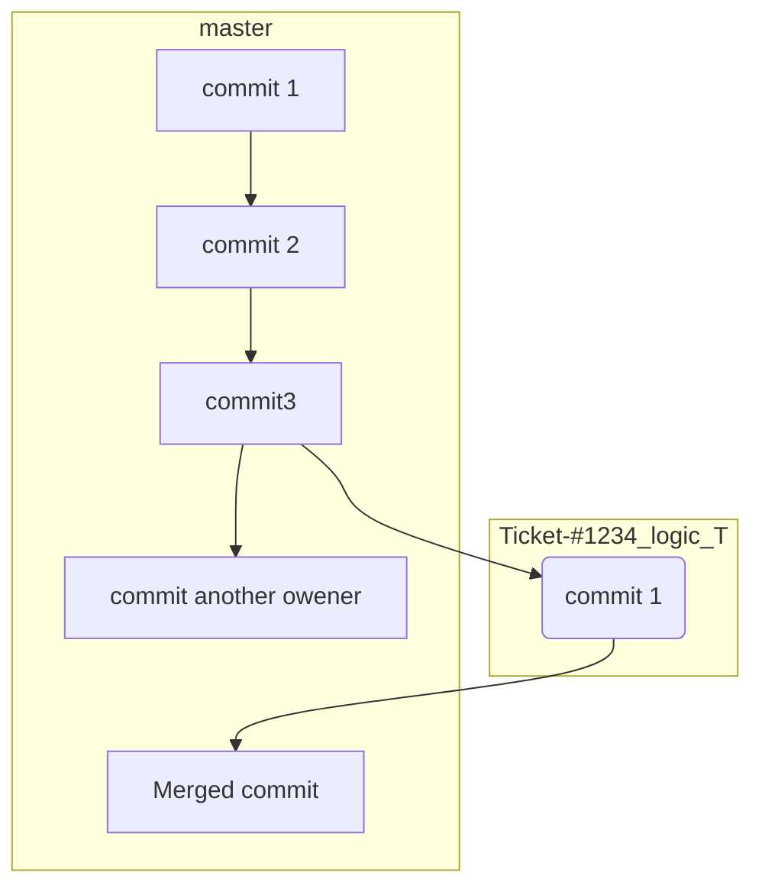

# Свойства веток

## Общее описание

Ветки (branch) - одно из мест хранения исходного кода, которая имеет различные свойства.
Подразделяются на основные (master/dev), и личного характера. Где ведется разработка.

По основным требованиям, ветки master и dev СТРОГО запрещены для внесения коммитов в них.
Потому как, dev ветка "разворачивается" на тестовом окружении, а master уже оказывается на "продакшен" стенде.

Основная рабочая ветка является - `dev`!!!


## Именование веток

Все ветки обязательно создаются от ветки `dev`, перед этим обязательно сделав `git pull origin master`.
Для того, чтобы у Вас имелась самая актуальная версия исходного кода, и в последующем не было конфликов при слиянии.
Если с основными ветками все понятно, то ветки, в которых ведется разраотка создаются следующим образом.
Имя ветки должно быть коротким, и понятно описывать суть реализованной логики в ней (километровые название не принимаются).

Новый функционал:
* `feature/Ticket-#<12345>_implement_catalog_logic`

Исправление баги/проблемного места:
* `bugfix/Ticket-#<12345>_casting_variable`

Быстрое исправление (хотфикс)
* `hotfix/Ticket-#<12345>_missed_migration`


Особое внимание! Ветку называем согласно тикету в Jira. Например, проект `<NONAME>`, 
номер задачи `423` и заголовок `Реализация API метода для валидации телефона`.
То название ветки будет выглядеть следующи образом:
 
`feature/Ticket-#423_implement_phove_validation`


## Именование коммитов

Не менее важный раздел, как и `Именование веток`, только тут мы не пишем просто `fixed`.
Потому как приходится догадываться что там подразумевалось под словом `fixed`.
Поэтому, формируем сообщение коммита следующим образом:

```notebook
Ticket #12345

fixed sting path render for template
added migration file at `Slider` model
added 3rd library for normalize user phone `libphonestruct-dev`
```

Разбирая пример выше:
* номер тикета с его префиксом
* ПЕРЕНОС СТРОКИ (необходим для разделения названия и описания в MR)
* само сообщение, которое хотите донести о проделанной работе


## Merge Requests

Тот самый раздел, где Ваш код доставится на сервер!

После того, как коммит отправляется в репозиторий, в консоле отображается ссылка для перехода для создания MR вашей ветки.
Либо можно переайти на сайт, где ведется разработка, и созда MR вручную, указав в качестве `Source` Вашу ветку, а `Destination` `dev`.

Почему именно `dev`? - Потому что, таким образом тестовый стенд будет актуального состояния, и уже после логической точки,
код отправляется в `master` ветку.

Указываем обязательно `Assignee` кто будет ревьювить Ваш MR.


## Ревью и проверка

На странице MR имеется возможность комментирования и оставление замечаний к коду.
Если есть замечание, отмечаем кнопкой коммнтарий и пишем свое мнения для исправления того или иного участка кода.
И ставим жирный лойс(:thumbsup:), если все устраивает, и значек какахи(:poop:) - если функционал требует доработки.
После того, как будет пройдено ревью (проверка кода) старшим разработчиком. MR закрывается и происходит слияние.

Особое замечание имеет свойства MR, обязательно помечаем флагом на удаление ветки после слияния.  
Так же, если коммитов в MR становится много (более 5), стоит дополнить это свойтсовм - `Squash commits`.
Который соберет все Ваши коммиты в 1, и уже он как финальный отправится в "залитую" ветку.


## Пример веток


